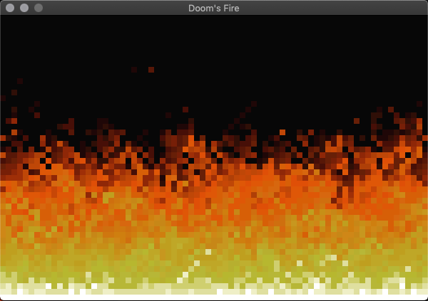

# Having fun with Sketch

## Setup
Make sure .asd files in the current directory can be loaded by ASDF:

    (pushnew '*default-pathname-defaults* asdf:*central-registry*)

Load the main system:

    (ql:quickload "sketch-fun")

## Experiments
### Doom's Fire

- Credits: [fabiensanglard/DoomFirePSX](https://github.com/fabiensanglard/DoomFirePSX/blob/master/flames.html)

Load the system:

    (ql:quickload "sketch-fun/doomfire")

Start the experiment:

    (doomfire:start)

Reset it (i.e. delete all the points):

    (doomfire:clear)

Stop it:

    (doomfire:stop)

### Quadtree

- Mouse click or drag-n-dop events add some random points to the plane (around
  the pointer location)
- All the points of the plane are fed into a quadtree, whose space subdivisions
  are rendered as gray rectangles
- A "search box" (the magenta rectangle) follows the mouse location, and is
  used to query the quadtree for all the points contained within that area
- The text at the bottom of the window shows the total number of elements
  contained in the quadtree, versus the number of checks that had to be done to
  figure out if a point was in the rectangle or not
- Credits: [The Coding Train - Coding Challenge #98: Quadtree](https://www.youtube.com/watch?v=OJxEcs0w_kE)

Load the system:

    (ql:quickload "sketch-fun/quadtree")

Start the experiment:

    (quadtree:start)

Reset it (i.e. delete all the points):

    (quadtree:clear)

Stop it:

    (quadtree:stop)
